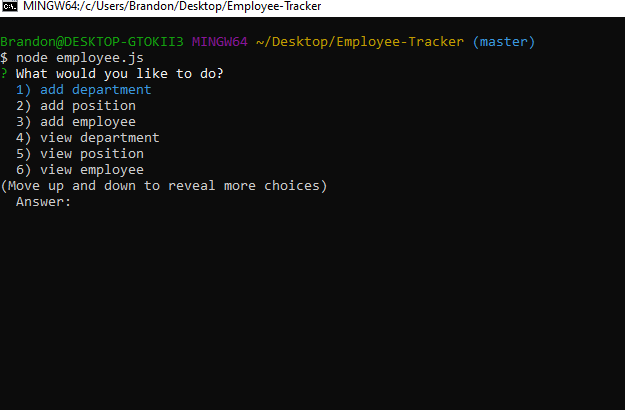

# Employment tracker
    
# Created on 08/15/2020

# By Brandon Perez

# Screen Shot
 

## Table of Contents
* [Description](#Description)
* [Installation](#Installation)
* [Knoun-bugs](#Known-bugs)
* [Technologies-Used](#Technologies-Used)
* [Contribution](#Contribution)
* [License](License)
## Description 
This node based application is to help companys track there employees and departments. Companys can can log,view,and update
variuos different employee data.
    
## Installation
1- run npm i, 2- run node employee.js
    
## Known-bugs
n/a
    
## Contact Information
brandonp940@gmail.com
    
## Technologies-Used 
JavaScript, node.js
    
## Contribution
https://bperez94.github.io/Employee-Tracker/
    
### License
MIT
